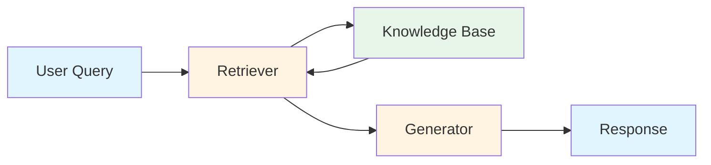
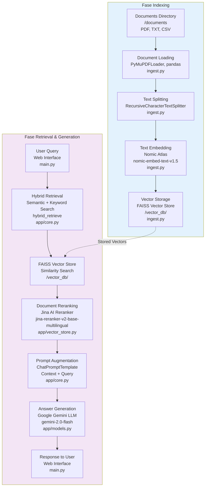
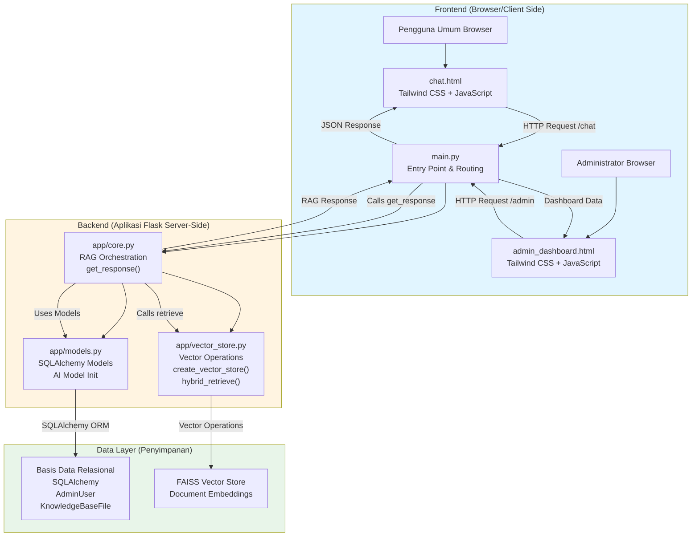

# RAG Chatbot AI (PPB UIN Jakarta)

A Retrieval-Augmented Generation (RAG) chatbot that answers questions based on local documents, accessible via a web admin dashboard and chat interface. Built with Flask, Google Gemini, Nomic Embeddings, and FAISS vector store.

---

## Features

- 🤖 **RAG-powered responses** based on local document knowledge base
- 🧠 **Google Gemini** for text generation
- 🔍 **Nomic Embedding** for text embedding
- 🏆 **Jina Reranker** for re-rank the retrieved documents
- 📚 **FAISS vector store** for efficient document retrieval
- 📄 **Multi-format support** (PDF, TXT, CSV documents)
- 📊 **CSV processing** with row-by-row conversion for structured data
- 🛡️ **Admin dashboard** for file upload, chunk preview, embedding, and vector DB management
- 🧩 **Chunk preview** before embedding
- 🗑️ **Vector DB management** (delete, re-embed)
- 🛡️ **Langsmith monitoring** and tracing support
- 🎨 **Modern UI** with Tailwind CSS and Bootstrap Icons
- 🔐 **Secure admin authentication** with login system
- 📱 **Responsive design** for mobile and desktop

---

## Prerequisites

- **Python 3.8+**
- **Node.js & npm** (for Tailwind CSS build)
- **Nomic API key** (for embeddings)
- **Google API key** (for text generation)
- **Jina API key** (for document reranking)

---

## Installation

1. **Clone the repository:**
   ```bash
   git clone <repository-url>
   cd ppb-ai-chatbot
   ```

2. **Install Python dependencies:**
   ```bash
   pip install -r requirements.txt
   ```

3. **Install Node.js dependencies (for Tailwind CSS):**
   ```bash
   npm install
   ```

4. **Configure environment variables:**
   ```bash
   cp env.example .env
   ```
   Edit `.env` with your credentials (see `env.example` for all options).

5. **Initialize the database and create admin user:**
   ```bash
   python main.py init-db
   ```

---

## Project Structure

```
ppb-ai-chatbot/
├── app/
│   ├── __init__.py
│   ├── core.py            # RAG chain logic and file processing
│   ├── models.py          # Database models and LLM initialization
│   └── vector_store.py    # FAISS vector store operations with Jina reranking
├── documents/             # Source documents folder (PDF, CSV, TXT)
├── vector_db/             # FAISS index and vector store
├── static/
│   ├── css/               # Tailwind CSS output
│   └── images/            # UI images (PPBOT_Logo.png)
├── templates/
│   ├── admin_dashboard.html  # Admin interface for file management
│   ├── admin_login.html      # Admin authentication page
│   └── chat.html             # User chat interface
├── main.py                # Flask web server with admin dashboard and API
├── requirements.txt       # Python dependencies
├── env.example            # Environment variables template
├── package.json           # Node.js scripts and dependencies
├── tailwind.config.js     # Tailwind CSS configuration
├── src/input.css          # Tailwind CSS input
├── build_css.py           # Python script to build Tailwind CSS
├── .gitignore             # Git ignore rules
└── README.md              # This file
```

---

## System Architecture

### 1. RAG Flow Diagram

Diagram berikut menunjukkan alur dasar sistem RAG:



### 2. Sistem RAG - Fase Indexing & Retrieval

Diagram berikut menunjukkan dua fase utama sistem RAG: Fase Indexing dan Fase Retrieval & Generation:



### 3. System Architecture - Web Application

Diagram berikut menunjukkan arsitektur lengkap aplikasi web dengan Flask:



---

## Usage

### 1. Add Documents
Place your source documents (PDF, TXT, CSV) in the `documents/` folder.

### 2. Build Tailwind CSS (for UI)
You can use either npm or Python:
- **With npm:**
  ```bash
  npm run build-prod
  ```
- **With Python:**
  ```bash
  python build_css.py
  ```
This generates `static/css/output.css` for the web UI.

### 3. Start the Flask Server
```bash
python main.py
```
The server will start on `http://localhost:5000`

### 4. Access the System
- **Home:** `http://localhost:5000/`
- **Chat Interface:** `http://localhost:5000/chat`
- **Admin Dashboard:** `http://localhost:5000/admin` (requires login)

---

## Admin Dashboard

- **URL:** `/admin` (requires authentication)
- **Features:**
  - Upload documents (PDF, TXT, CSV)
  - Preview chunking before embedding
  - Embed all files to vector DB
  - Delete individual files (removes from DB and disk)
  - Delete all vector DB contents (enables re-embedding)
  - View file status and embedding progress
  - Professional UI with modern design

---

## Chat Interface

- **URL:** `/chat`
- **Features:**
  - Clean, professional chat interface
  - Markdown support for better response readability
  - Responsive design for mobile and desktop
  - Real-time chat with the RAG system

---

## API Endpoints

- `GET /api/health` - Health check
- `GET /api/test` - System test endpoint
- `POST /api/chat` - Chat API endpoint
- `GET /api/files` - List uploaded files
- `POST /api/preview-chunking` - Preview document chunking
- `GET /api/kb_status` - Knowledge base status
- `POST /api/admin/embed_all` - Embed all files
- `GET /api/admin/embed_progress` - Embedding progress

---

## Environment Variables

Required environment variables (see `env.example`):
- `GOOGLE_API_KEY` - Google Gemini API key
- `NOMIC_API_KEY` - Nomic embeddings API key
- `JINA_API_KEY` - Jina reranking API key
- `SECRET_KEY` - Flask secret key
- `DATABASE_URL` - Database connection string (defaults to SQLite)

---

## Frontend Build (Tailwind CSS)

- **Input:** `src/input.css`
- **Output:** `static/css/output.css`
- **Config:** `tailwind.config.js`
- **Build:** `npm run build-prod` or `python build_css.py`

---

## Security & Best Practices

- **Never commit your `.env` file or secret keys**
- `.gitignore` is set up to ignore secrets, data, and generated files
- Use a separate environment for development and production
- Admin authentication required for sensitive operations
- Regularly update dependencies

---

## Troubleshooting

- **Vector store not found:**
  - Upload files through the admin dashboard and click "Embed Data"
- **API key errors:**
  - Check your `.env` file for correct keys
- **Admin login issues:**
  - Run `python main.py init-db` to create admin user
- **Tailwind CSS build errors:**
  - Ensure Node.js and npm are installed
  - Run `npm install` before building CSS

---

## License

This project is licensed under the MIT License.

---

## Contributing

1. Fork the repository
2. Create a feature branch
3. Make your changes
4. Add tests if applicable
5. Submit a pull request

---

## About

This chatbot is designed for the Pusat Pengembangan Bahasa (PPB) UIN Syarif Hidayatullah Jakarta, with support for Indonesian language, local document retrieval, and a professional web interface for knowledge base management.

---

## Recent Updates

- ✅ **Professional UI Design** - Modern, responsive interface with Tailwind CSS
- ✅ **Admin Authentication** - Secure login system for admin dashboard
- ✅ **File Management** - Upload, preview, embed, and delete documents
- ✅ **Jina Reranking** - Top 3 document reranking for better responses
- ✅ **Markdown Support** - Enhanced chat response readability
- ✅ **Mobile Responsive** - Optimized for all device sizes 
